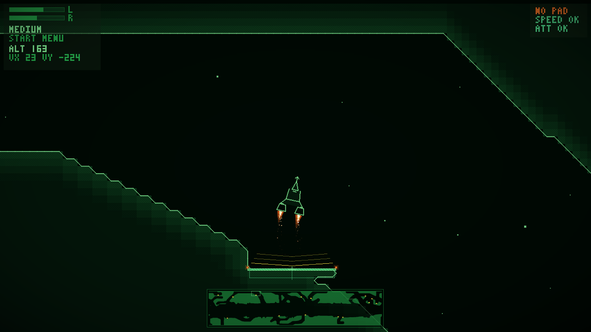

<!--
SPDX-License-Identifier: GPL-3.0-or-later
-->
# dualthrust

A small CRT-green **cave lander** with two engines and nothing else. Each trigger drives one
engine: push both to climb, favour one side to rotate and slide sideways. Fly through a wrapping
2D cave and set the ship down on a landing pad.



## Playing

The ship has no steering, just a left and a right engine mounted a little apart. Equal thrust
lifts you straight up, uneven thrust spins you, and a tilted ship pushes sideways. Gravity never
stops pulling, so every correction costs altitude.

**Landing.** Touch down on a pad (the striped deck with blinking beacons) while all of these hold:

| Check | Limit |
|-------|-------|
| Descent speed | under 55 px/s |
| Sideways speed | under 40 px/s |
| Tilt | under about 13° |
| Spin | slow |

The HUD (top right) shows `PAD`, `SPEED` and `ATT` status as you approach. Brush the rock at low
speed and you simply bounce; only a hard impact (over 200 px/s into the surface) destroys the
ship. After a crash, **A/B** or **R** respawns on a random pad; after a landing it relights the
engines. The cave is never regenerated by a crash.

The cave is 24000 × 4800 px and wraps horizontally: fly far enough one way and you come back
from the other. The minimap at the bottom shows the whole world, the landing pads (yellow) and where
you are.

### Ships

Seven presets, switched with the menu, **Tab**, or **Select**. Heavier and wider ships are
steadier but slower to turn.

| Preset | Notes |
|--------|-------|
| Narrow, Medium, Wide, Barge, Long | Engines at the bottom |
| Topdog, Canopy | Engines mounted on top; they still push the ship up |

## Controls

| Input | Action |
|-------|--------|
| Triggers, L1/R1, or stick up (left/right) | Left / right engine |
| Keyboard **A** / **D** (or arrows) | Left / right engine |
| **Start** / **Escape** | Menu (Escape quits from the menu) |
| D-pad or Up/Down, **A** / Enter | Navigate / select in the menu |
| **A**/**B** or **R** | Respawn after a crash, relight after a landing |
| **Y** or **G** | New cave |
| **Select** or **Tab** | Next ship |
| **X** | Swap left/right engines |
| **F** or **Alt+Enter** | Fullscreen |
| **M** | Sound on/off |

The menu has Resume, Fullscreen, New Cave, Ship Preset, Swap Engines, Sound and Quit.

## Sound

Everything is synthesised at runtime, so there are no audio files: engine rumble (panned left and
right), landing, bounce and crash effects, and a slow generative ambient loop. Toggle with **M** or
the menu; start muted with `--mute`. If no audio device is available the game runs silently.

## Build and run

Requires SDL2, CMake and a C++17 compiler. With Nix:

```sh
nix develop
dualthrust-configure && dualthrust-build && dualthrust-run
# or simply
nix run
```

## Command line

```
dualthrust [options]
  -f, --fullscreen     start fullscreen
  -w, --window WxH     window size (default 1280x720)
  -s, --ship N         ship preset 0..6
  -S, --seed N         cave seed (same seed, same cave)
  -x, --swap-engines   swap left/right
  -m, --mute           start with sound off
  --config-dir PATH    use another config directory
```

`--play`, `--thrust L,R`, `--frames N` and `--screenshot FILE` exist for automated testing;
see `dualthrust --help`. A man page (`man dualthrust`) is installed with the game.

## Config

Fullscreen, ship, engine swap and sound are saved to `$XDG_CONFIG_HOME/dualthrust/config`
(default `~/.config/dualthrust/config`).

## R36S handheld (ArkOS / PortMaster)

A native aarch64 build for the R36S runs at 60 fps on the 640×480 panel:

```sh
nix build .#dualthrust-r36s-portmaster-zip   # PortMaster autoinstall zip
```

Copy `Dualthrust.sh` and `dualthrust/` to `/roms/ports/`, or drop the zip into PortMaster's
`autoinstall` folder. See [AGENTS.md](AGENTS.md) for the sysroot, build and performance notes.

## Desktop install (Linux)

CMake installs the binary, `.desktop` file, icons, man page and AppStream metainfo.

## License

GPL-3.0-or-later.
